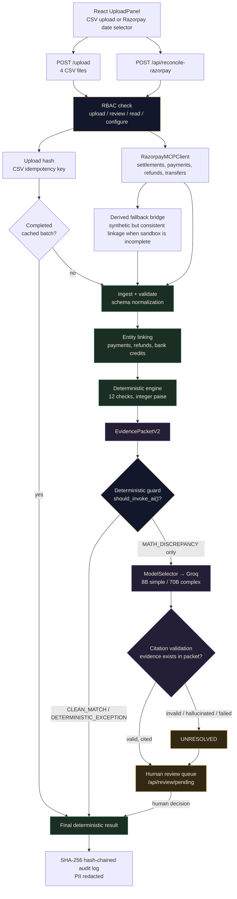
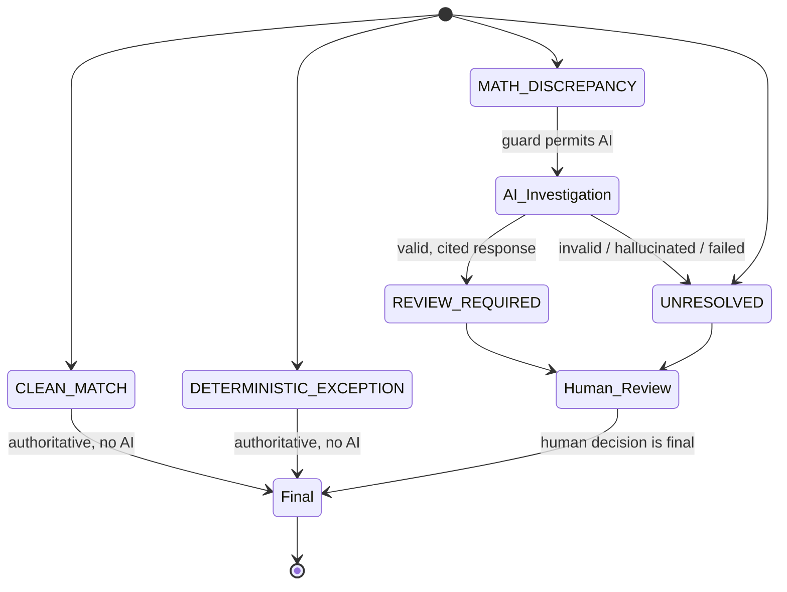

# Nivara
> Settlement reconciliation for Razorpay Standard Checkout — deterministic math, advisory AI, human decides.

[](#)
[](#evaluation--results)
[](#evaluation--results)
[](#evaluation--results)
[-critical)](#ai-judgment)

**Track 04 — AI Finance Controller** · Razorpay Buildathon 2026


---

## Overview

Nivara reconciles Razorpay settlements against transactions, refunds, and bank credits — either from four uploaded CSVs or a live Razorpay sandbox pull. It runs **12 deterministic checks** in integer paise (no floating-point money math), and calls an LLM only for the cases the math genuinely cannot explain.

- **12** deterministic reconciliation checks
- **0%** AI auto-approval rate — schema-enforced, not a policy promise
- **87.5%** match rate on an 80-settlement evaluation set (2 disclosed blind spots)
- **763** tests passing, **89%** backend coverage
- **~36,000** in-memory reconciliations per second (pure compute, no I/O)

The AI never touches money. It classifies *why* a discrepancy exists — the deterministic engine still decides *whether* one exists.

---

## The Problem

Merchants reconciling Razorpay settlements must cross-check transactions, refunds, settlement reports, and bank credits manually — references, fees, taxes, UTRs, and arithmetic, across four data sources that do not always agree.

Most "AI reconciliation" demos address this by handing raw rows to an LLM and trusting whatever comes back. That approach is fast to build and impossible to audit.

Nivara's premise: **prove what can be proven with code, and ask AI only to explain what code cannot.**

| Naive LLM wrapper | Nivara |
|---|---|
| Sends raw CSV rows to the model | Sends structured, cited evidence packets |
| LLM computes amounts | Python computes every amount, in integer paise |
| LLM can approve a transaction | LLM's only possible action is `ESCALATE_TO_HUMAN` |
| Explanations are unverifiable | Every citation is checked against the evidence packet |
| No measured accuracy | 80-settlement labeled evaluation set, published match rate |

---

## How It Works



1. **Ingest** — four CSVs (transactions, settlements, refunds, bank credits) or a live Razorpay sandbox pull via `/api/reconcile-razorpay`, with a derived-fallback bridge when the sandbox does not expose full linkage.
2. **Deterministic engine** — 12 checks in integer paise: references, linkage, fees, taxes, bank credits, UTRs, settlement arithmetic.
3. **Guard** — only `MATH_DISCREPANCY` cases (math that does not resolve) are eligible for AI. Clean matches and clear exceptions never reach the model.
4. **AI classification** — `ModelSelector` routes simple cases to Groq's 8B model and complex cases to 70B, given a structured evidence packet (`EvidencePacketV2`), never raw rows.
5. **Citation validation** — every fact the model cites must exist in the evidence packet; invented citations result in the response being rejected.
6. **Human review** — the model's only possible recommendation is escalation. A human makes the final determination, through `/api/review/{id}/decision`.
7. **Audit** — every batch and every decision is written to a SHA-256 hash-chained, append-only log, with PII redacted before persistence.

### Decision State Machine



`CLEAN_MATCH` and `DETERMINISTIC_EXCEPTION` are final deterministic outcomes — the AI never sees them. `MATH_DISCREPANCY` is the only state eligible for AI investigation, and it remains human-reviewable regardless of the AI's output.

---

## AI Judgment

**Where AI is used:** classifying *why* a `MATH_DISCREPANCY` exists — timing mismatch, refund timing, or genuinely unexplained — from a structured evidence packet.

**Where AI is deliberately not used:** arithmetic, currency amounts, linkage checks, fee/tax verification, approval decisions. All of that is handled by Python, in integer paise, through 12 explicit rules.

**Enforced, not promised:**

- The `AIResponse` schema is `extra="forbid"` — the model cannot inject new fields.
- The only valid `recommended_action` is `ESCALATE_TO_HUMAN`. There is no `APPROVE` value in the schema for the model to select.
- `validate_citations()` checks every cited evidence ID against the actual evidence packet; a hallucinated citation results in the response being discarded and the case marked unresolved.
- Any LLM failure — timeout, malformed response, hallucination — becomes `UNRESOLVED` with `escalate_to_human=True`. The system never silently assumes a discrepancy is acceptable.

---

## Evaluation & Results

Measured against an 80-settlement synthetic evaluation set spanning 11 edge-case categories.

| Metric | Result |
|---|---:|
| Evaluation settlements | **80** |
| Match rate | **87.5%** |
| False accept rate (disclosed blind spots) | **12.5%** (10 settlements, 2 known categories) |
| Per-class macro F1 | **0.82** |
| Deterministic throughput | **~36,000 reconciliations/sec** (in-memory, no I/O) |
| AI auto-approval rate | **0%** (schema-enforced) |
| Test suite | **763 passing** |
| Backend coverage | **89%** |

The dataset is synthetic and co-designed with the engine — a 100% match rate would indicate the engine only catches what it was built to catch, which would be a limitation rather than an achievement. 87.5% with disclosed blind spots is presented as the accurate figure.

**Two known blind spots, disclosed deliberately:** `refund_after_settlement` and `timing_race` — cases that appear clean to the deterministic engine but carry a genuine exception. These require live LLM investigation or additional business rules not implemented in the current scope. They are named explicitly rather than omitted.

---

## Architecture

FastAPI backend, React/Vite frontend. The backend recently underwent a router split — a single 1,300-line `main.py` was separated into app wiring plus focused modules:

```
backend/
├── main.py              # FastAPI app, middleware, startup checks, router mounting
├── job_store.py          # in-memory job store + rate limiter (dependency-free)
├── response_shaping.py   # shared result-summary computation (upload + live-fetch use the same shape)
├── api_helpers.py        # helpers shared across route modules
├── engine.py              # 12 deterministic checks
├── ai_investigator.py     # Groq investigation + citation flow
├── ai_validator.py        # response/citation validation
├── model_selector.py       # routes simple/complex evidence to 8B/70B
├── deterministic_guard.py # decides which cases may reach AI at all
├── rbac.py                 # upload/review/read/configure permissions
├── audit.py                 # SHA-256 hash-chained audit log
├── pii_redaction.py         # redaction before persistence
└── routes/
    ├── upload.py           # POST /upload
    ├── status.py            # GET /status/{job_id}
    ├── audit.py              # GET /audit/{upload_hash}, /verify, /settlement/{id}
    ├── review.py              # human review queue + decisions
    ├── razorpay.py             # live fetch + reconcile, RBAC-gated
    ├── metrics.py               # /api/metrics, /metrics (Prometheus)
    ├── health.py                 # deep health check (DB, LLM, disk)
    ├── v1.py                      # versioned sub-API
    └── frontend.py                 # static + SPA serving
```

### Tech Stack

| Layer | Technology |
|---|---|
| Backend | Python 3.11+, FastAPI, Uvicorn, Pydantic v2 |
| AI | Groq SDK (8B/70B via `ModelSelector`), optional OpenAI fallback path |
| Persistence | SQLite audit log (hash-chained), optional PostgreSQL branch |
| Metrics | JSON + optional Prometheus exposition |
| Frontend | React 18, Vite, Recharts |
| Tests | pytest, pytest-cov, mypy (strict on RBAC/secrets/PII modules) |

---

## Engineering Challenges & Decisions

The following are design decisions made during development, not hypothetical failure modes. Each one changed the architecture.

### 1. The Heuristic Trap → Deterministic-First Architecture

An early version of the system used a `DemoLLMClient` that applied regex rules to simulate AI classification with fabricated confidence scores. This was identified as a significant risk for financial reconciliation — a missing API key could silently process millions of settlements with fabricated AI reasoning, with no downstream indication that the displayed "AI confidence" was a regex match presented as a probability.

The module — 524 lines — was removed entirely, and the system was rebuilt to **fail fast on missing credentials** rather than degrade silently. The architecture was restructured around a firm separation: a 12-check integer-math engine that serves as the **sole authority on correctness**, with Groq operating as an advisory-only explainer for cases the math cannot resolve. AI cannot override deterministic math, nor represent its output as more certain than it is.

### 2. The AI Hallucination Problem → the `EvidencePacketV2` Contract

LLMs are prone to hallucinating evidence. Allowing an AI to cite a `fee_evidence` ID that did not exist in the deterministic checks was judged unacceptable — a confident-sounding explanation built on a fabricated citation is worse than no explanation at all.

`EvidencePacketV2` — a typed, structured contract between the engine and the AI — and an accompanying `AIValidator` were built to reject any AI response citing evidence IDs outside the packet. Invalid AI outputs become `UNRESOLVED` and escalate to human review; they are never auto-approved and never pass through silently as though the citation had been verified.

### 3. The Free-Tier Rate Limit → `ModelSelector` as Cost Control

Groq's free tier imposes strict limits — 20 requests per minute, 6,000 tokens per minute. Rather than upgrading to a paid tier, routing was optimized instead: `ModelSelector` sends simple settlements (1–2 evidence types present) to the 8B model and reserves the 70B model for genuinely complex cases.

Combined with the deterministic engine resolving 87.5% of cases at **zero AI cost** — those settlements never reach a model at all — the system remains comfortably within free-tier limits while preserving accuracy on the harder cases where it matters most.

### 4. The Live Data Gap → the Derived Fallback Bridge

Razorpay's sandbox API returns settlements, but not always the matching transactions, refunds, or bank credits alongside them. Feeding settlements into the engine with empty linkage arrays produced a 100% exception rate — every settlement flagged, which made the live-fetch path appear broken even when the underlying settlement data was sound.

A **derived-fallback bridge** was built to construct synthetic but mathematically consistent matching data directly from the settlement record itself — the transaction is reconstructed from amount plus fees, and the bank credit is reconstructed from the UTR. This allows real Razorpay sandbox data to reconcile end-to-end instead of failing immediately on import.

---

## Current Scope & Limitations

- Standard Checkout settlements only — RazorpayX payouts, Smart Collect virtual accounts, and Route split settlements are not implemented.
- The active audit path is SQLite; a PostgreSQL branch exists in the codebase but is not the production-selected backend.
- The job store is in-memory — a server restart loses in-flight job state (the audit trail itself persists in SQLite).
- Redis/Celery modules exist as optional code and are not wired into the synchronous API path.
- Two disclosed blind spots in the evaluation set (`refund_after_settlement`, `timing_race`) that the deterministic engine cannot currently catch.
- The derived-fallback bridge produces mathematically consistent but synthetic linkage when the sandbox does not expose real transaction/refund/bank-credit rows — it demonstrates reconciliation mechanics on live data, not independently verified live linkage.

---

## Planned Improvements

1. **Persistent job queue** (Redis/SQS) — removes the in-memory job-store restart risk.
2. **Asynchronous batch processing** — for large uploads, decoupled from the request/response cycle.
3. **Multi-tenant isolation** — the current design is single-tenant; production would require per-tenant audit trails and access control.
4. **Resolution of the two disclosed blind spots** — likely requiring targeted business rules rather than additional LLM calls.

None of these affect the core reconciliation logic or the AI-advisory-only guarantee — they represent infrastructure deliberately left out of the hackathon scope.

---

## Running Locally

```bash
git clone PASTE_REPO_URL_HERE
cd Nivara
python3 -m venv .venv
. .venv/bin/activate
pip install -r requirements.txt
cp .env.example .env
export GROQ_API_KEY=your_key   # required — app fails fast at startup without it
uvicorn backend.main:app --reload
```

Frontend (separate terminal):

```bash
cd frontend
npm install
npm run dev
```

Tests:

```bash
pytest -q
pytest --cov=backend --cov-report=term -q
```

> **Security note:** if `NIVARA_API_KEY` is left unset, every caller is treated as an administrator — acceptable for a local demo, but not for any deployment reachable by untrusted callers.

---

## Demo


| [](https://drive.google.com/file/d/10I02TWGESUp7Hxkowie0k_5rxsdy_i8g/view?usp=sharing) | [](https://drive.google.com/file/d/1DOOKQri_9DILnuOVG0GL3BGMRL_OnxRu/view?usp=sharing) |
|:---:|:---:|
| **Upload flow** | **Dashboard / results** |

| [](https://drive.google.com/file/d/1gS704FCdzjWkPrlcU28ogF3r5HdaEsEa/view?usp=sharing) | [](https://drive.google.com/file/d/1RhA1vY4UZQZPtb-Q1b4yzzH_Aa5JEuhN/view?usp=sharing) |
|:---:|:---:|
| **Human review queue** | **Audit trail** |

The demo covers the reconciliation problem, the live upload → deterministic engine → AI classification → human review → audit trail flow, and the measured evaluation results above.

---

## Track 04 Alignment

| Requirement | Nivara |
|---|---|
| AI Finance Controller | ✅ Deterministic engine decides, AI classifies exceptions only |
| Measured accuracy | ✅ 87.5% match rate, disclosed blind spots |
| Throughput | ✅ ~36,000 reconciliations/sec (deterministic path) |
| AI judgment shown honestly | ✅ 0% auto-approval, schema-enforced, citation-validated |
| Failure recovery documented | ✅ See "Engineering Challenges & Decisions" above |
| Audit trail | ✅ SHA-256 hash-chained, PII-redacted |

---

## Submission

**Track:** Track 04 — AI Finance Controller
**Repository:** PASTE_REPO_URL_HERE
**Demo:** PASTE_VIDEO_URL_HERE

---

> Nivara was not optimized for a polished demonstration. It was optimized to be a reconciliation engine that distinguishes between "this matches" and "this is uncertain" — and does not conflate the two.
