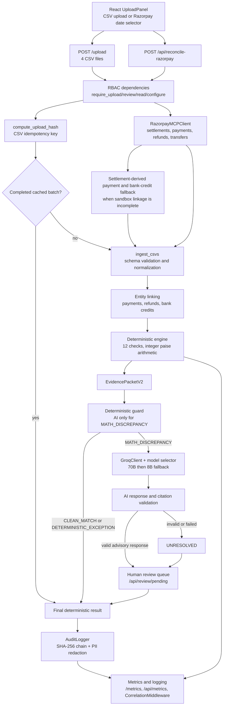
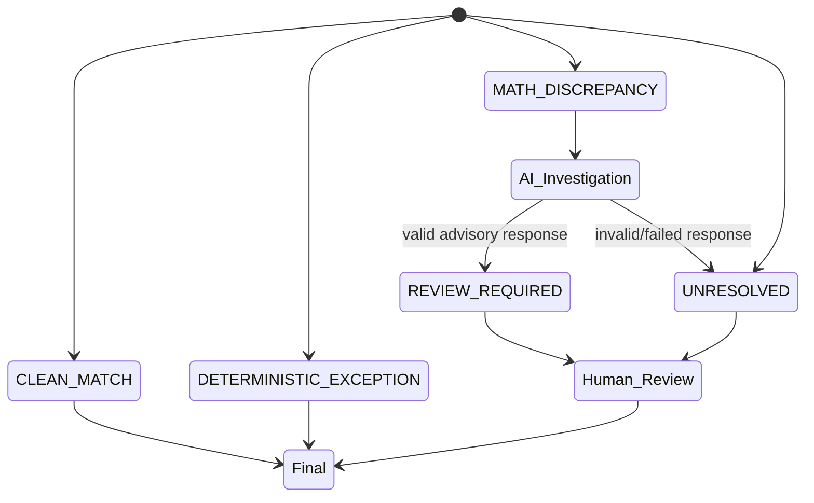

# Nivara Architecture

Nivara reconciles Standard Checkout settlement data through a synchronous FastAPI application. The deterministic engine owns financial arithmetic; the Groq path is advisory and only investigates math discrepancies.

## System Flow

## Component Responsibilities

- **React frontend:** selects four CSV files, sends uploads, and offers the Razorpay date-range selector.
- **RBAC layer:** checks `X-API-Key` roles. Upload requires upload permission; review decisions require review permission; pending review reads require read permission; JSON metrics require configure permission. When `NIVARA_API_KEY` is unset, the dependency grants demo admin access.
- **Upload hash and cache:** the upload handler computes the canonical hash, checks for a completed in-memory job with durable audit records, and returns the cached job without reprocessing.
- **Razorpay MCP client:** fetches settlements and, for reconciliation, payments, refunds, and transfers. If sandbox collections do not provide complete linkage, the endpoint derives a matching payment and bank credit from each settlement.
- **Ingestion:** validates and normalizes the four CSV inputs into engine dictionaries.
- **Entity linker:** resolves authoritative settlement payment/refund IDs and matches bank credits by UTR and amount/date rules.
- **Deterministic engine:** performs twelve checks and computes expected amounts and differences using integer paise arithmetic.
- **EvidencePacketV2:** carries structured summaries and deterministic evidence to the AI investigator.
- **Deterministic guard:** `should_invoke_ai()` permits AI only for `MATH_DISCREPANCY`; deterministic outcomes remain authoritative.
- **Groq client and fallback chain:** selects the 70B or 8B Groq model, applies rate and circuit-breaker controls, and fails to unresolved when calls fail.
- **AI validator:** parses response fields and validates citations against the evidence packet.
- **Human review queue:** exposes pending cases and accepts APPROVE, REJECT, or MODIFY decisions.
- **Audit logger:** persists append-only records using SHA-256 payload/previous-hash chaining. `redact_dict()` removes PII from explanations, notes, reviewer IDs, and nested payload fields before persistence.
- **Observability:** Prometheus metrics are available when the optional client is installed; JSON dashboard metrics are always backed by in-memory trackers. `CorrelationMiddleware` propagates and returns `X-Request-ID`.

## Decision State Machine

`CLEAN_MATCH` and `DETERMINISTIC_EXCEPTION` are final deterministic outcomes. `MATH_DISCREPANCY` receives optional AI investigation and remains human-reviewable. Invalid or unavailable AI becomes `UNRESOLVED`.

## Data and Persistence

The active audit path is SQLite at `data/audit/audit.db`, and jobs are held in the process-local `_jobs` store. `backend/database.py` contains a separate optional PostgreSQL abstraction selected by `NIVARA_DATABASE_URL`; it is not currently used by `AuditLogger`. Redis/Celery support is present in optional task code but is not used by the synchronous upload handler.

## Scope

Supported input is Razorpay Standard Checkout settlement reconciliation in CSV or the live settlement integration. RazorpayX payouts, Smart Collect, Route splitting, multi-currency processing, and real-time webhook processing are not implemented.
